# Bare Minimal Linux Kernel & RootFS

> [!NOTE]
> 
> Compared to the original project from which this repo has been forked the changes
> in initramfs.cpio are in `update` folder, and the `README.md`. While `start.sh`
> has been added to facilitate the use for those clone or download the zip file.

- **Linux** Kernel version 5.13.2

- **BusyBox** version 1.33.1

- **ToyBox** 0.8.13 &nbsp; (*as a lighter alternative*)

---

## Quick start

- download [`bzImage`](https://github.com/robang74/bare-minimal-linux-system/raw/refs/heads/main/bzImage), [`initramfs.cpio.gz`](https://github.com/robang74/bare-minimal-linux-system/raw/refs/heads/main/initramfs.cpio.gz) and the [`start.sh`](https://github.com/robang74/bare-minimal-linux-system/raw/refs/heads/main/start.sh) script

  - or downlod and extract the [zip archive](https://github.com/robang74/bare-minimal-linux-system/archive/refs/heads/main.zip) of the wholre repository.

- launch with the script `sh start.sh` the QEMU virtual machine

- alternatives: [initrobfs.cpio.gz](initrobfs.cpio.gz) with toybox and Linux [x86_64.tgz](https://landley.net/toybox/downloads/binaries/mkroot/0.8.13/x86_64.tgz) 6.17.0 w/ network support by Rob Landlay

### QEMU install for Ubuntu

```sh
sudo apt update
sudo apt install qemu-kvm libvirt-daemon-system libvirt-clients bridge-utils virt-manager

sudo adduser $USER libvirt
sudo adduser $USER kvm
```

A quick test to check installation

```sh
kvm-ok
qemu-system-x86_64 --version
```

This is an optional but useful for those who wants customise the system quickly

```sh
sudo apt install fakeroot
```

---

## Configuring the Linux Kernel

- OS: Ubuntu 20.04 LTS or newer

```sh
sudo apt-get update
sudo apt-get install git fakeroot build-essential ncurses-dev xz-utils \
    libssl-dev bc flex libelf-dev bison qemu-system-x86
```

### Download 

```sh 
wget https://cdn.kernel.org/pub/linux/kernel/v6.x/linux-6.5.7.tar.xz
tar -xvf linux-6.5.7.tar.xz
cd linux-6.5.7
```

### Configure tiniest possible kernel 

```sh  
make allnoconfig
```

This will create .config file setting values to 'n' as much as possible.

### Customization

```sh
make menuconfig 
```

or alternatively from Linux-5.10.54 and newer

```sh
make defconfig # creates a .config file
make kvmconfig # modifies .config to set up everything necessary for it to run on QEMU
# or make kvm_guest.config in more recent kernels
```

This will open a window with many Linux kernel configuration settings. You can enable or disable those settings and customize the Linux kernel as needed.

Tips: use left, right, up and down arrow key to navigate 

- Now set following options-

#### Option 1: Enable 64 bit support 

- Enable 64 support 

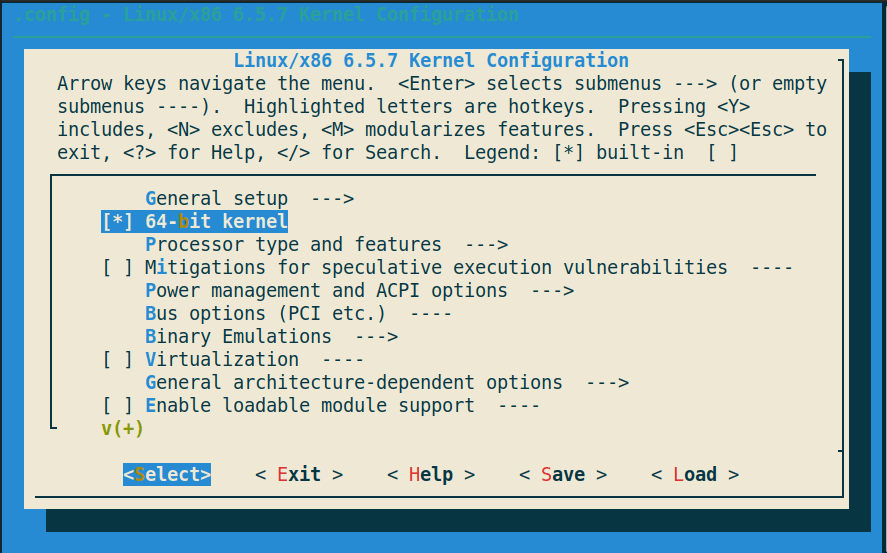

#### Option 2: Hostname

- General setup >> Default hostname

- Set a Host name `Embedded_linux`

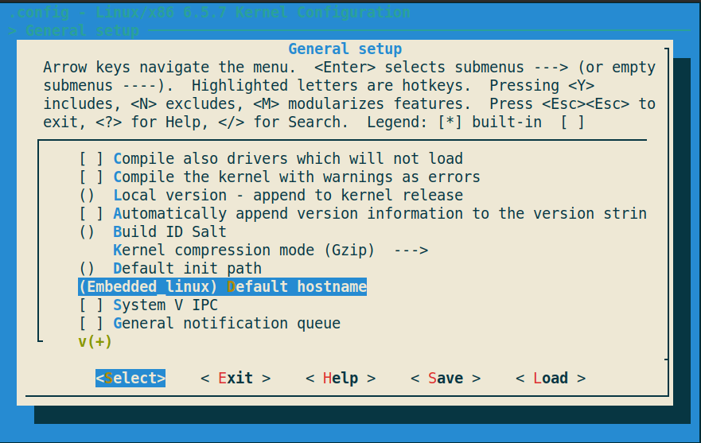

#### Option 3: Enable support for RAM disk

- General Setup >> Initial RAM filesystem and RAM disk (initramfs/initrd) support

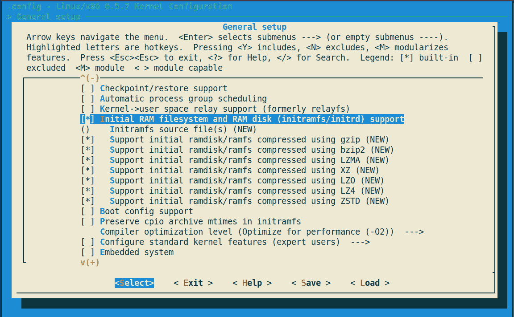

#### Option 4: Configure standard kernel features

- General Setup > Configure standard kernel features (expert users)

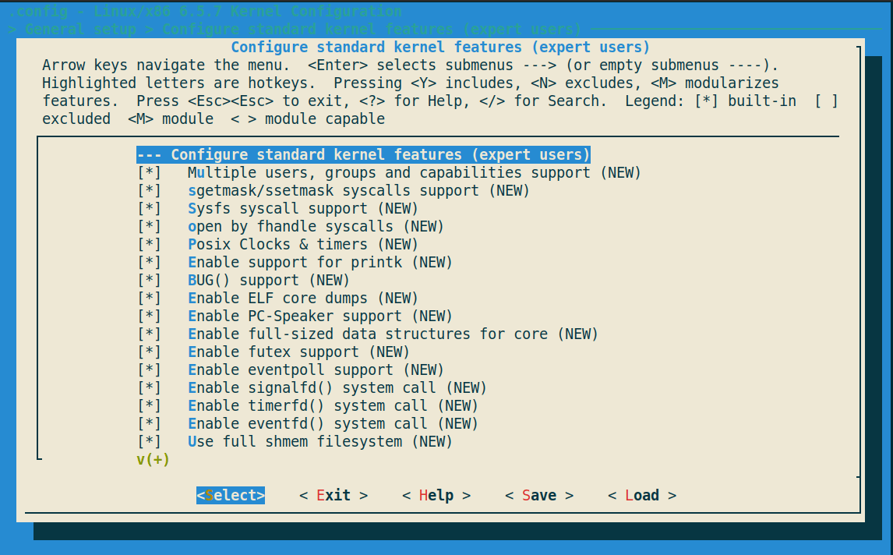

#### Option 5: Ensure Gzip Kernel compression

- General Setup >kernel compression mode (Gzip)

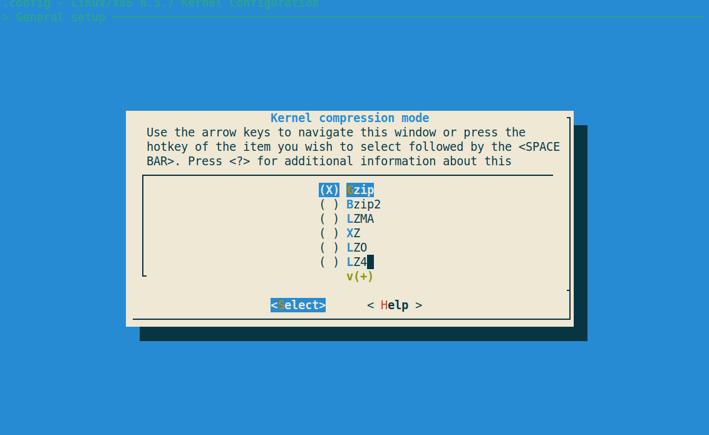

#### Option 6: ELF binary and script

- Executable file formats > Kernel support for ELF binaries

- Executable file formats > Kernel support for scripts starting with #!

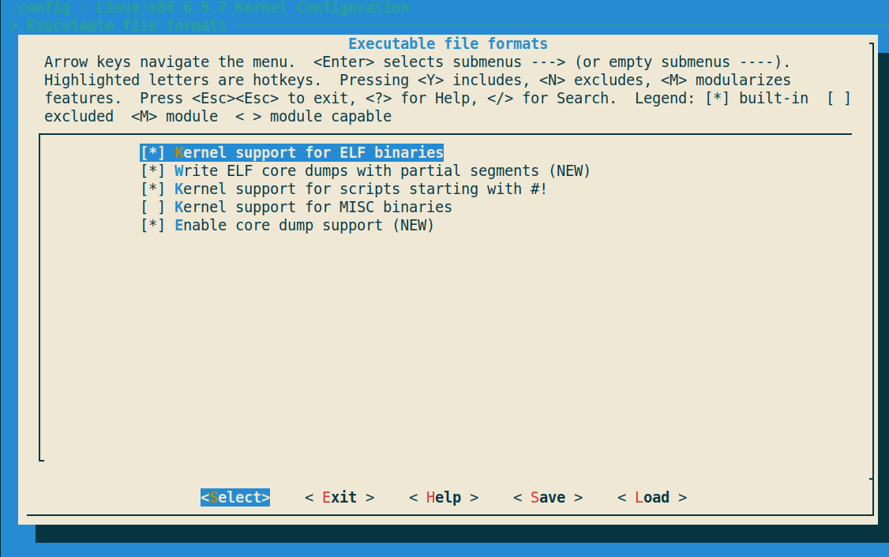

#### Option 7: Enable devtmpfs

- Device Driver > Generic Driver Options > Maintain a devtmpfs filesystem to mount at /dev

- Device Driver > Generic Driver Options > Automount devtmpfs at /dev, after the kernel mounted the rootfs

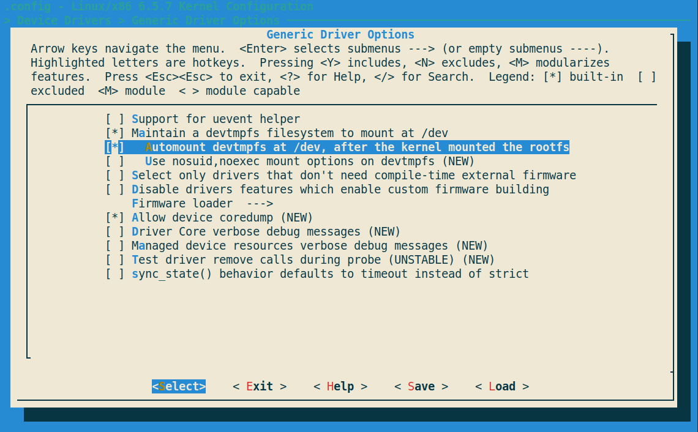 

#### Option 8: Enable TTY

- Device Driver > Character devices > Enable TTY

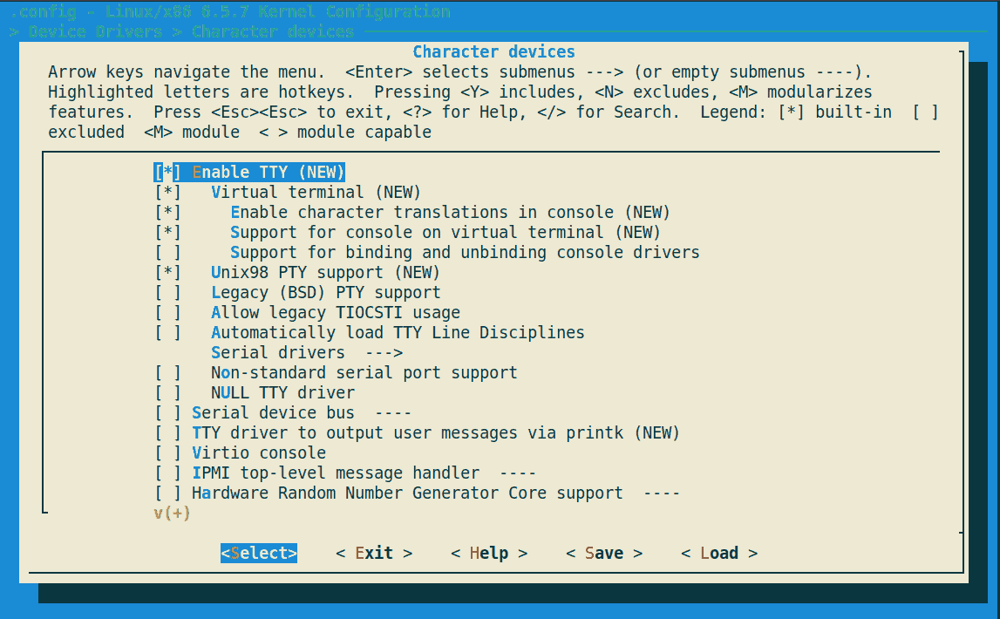 

#### Option 9: Enable Serial Drivers

- Device Driver > Character devices > Serial Drivers  > 8250/16550 and compatible serial support

- Device Driver > Character devices > Serial Drivers  > Console on 8250/16550 and compatible serial port

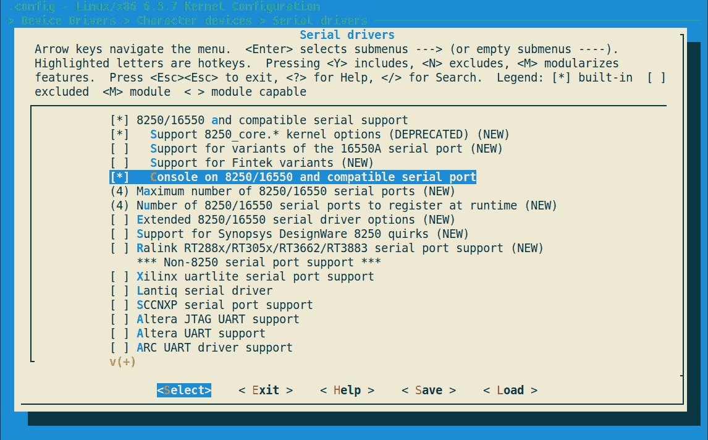 

#### Option 10: Pseudo filesystems

- File systems > Pseudo filesystems > /proc file system support

- File systems > Pseudo filesystems > /sysfs file system support

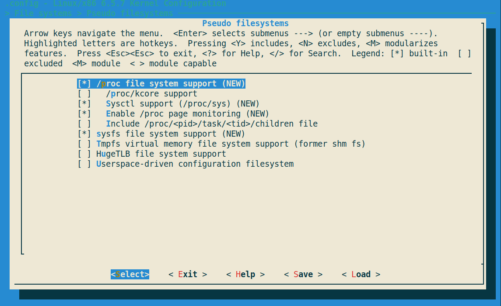 

Now, save and close the configuration window.

---

## Building the Linux Kernel

Here is the build command to build Linux kernel.

```sh
make -j4
```

Here `make -j <number of cpu>`, it will take 1.28min for me.

To see how many CPU Core or How mane processor you have type

```sh
nproc
```

Your Linux kernel is now ready and can be found in the `linux-6.5.7/arch/x86/boot` directory.

```sh
cd linux-6.5.7/arch/x86/boot
ls -sh bzImage
```

Linux Kernel Size: 1.7MB

Create a working Directory and put the linux kernel image 

```sh
mkdir -p ~/workspace_kernel/linux-kernel
cp linux-6.5.7/arch/x86/boot/bzImage ~/workspace_kernel/linux-kernel
```

### Creating Initramfs 

Downloading latest Busybox

```sh
wget https://busybox.net/downloads/busybox-1.36.0.tar.bz2
```

change working path to workspace directory

```sh 
cd ~/workspace_kernel
```

extracting the Busybox source tree

```sh
tar -xvf busybox-1.36.0.tar.bz2
```

change working path to busybox

```sh
cd busybox-1.33.1
```

Customize busybox

```sh
make menuconfig
```

This will start configuration menu for BusyBox. We need only one setting. 

Settings > Build static binary (no shared libs)

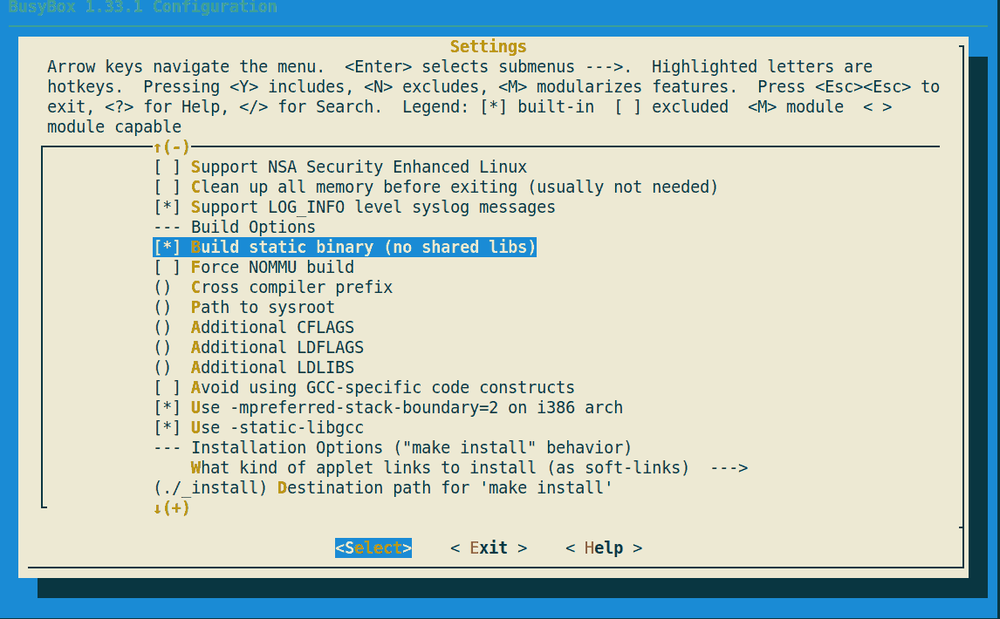 
<br/>
<br/>

Now, exit and save.

It is time to build busybox.

Build

```sh 
make -j4
make -j <number of CPU core>
```

To see how many CPU Core or How mane processor you have type

```sh
nproc
```

More general command

```sh
make -j ${nproc}
```

Install  

```sh
make install
```

This will install binaries in “./_install” directory

```sh
another command to install busybox in user specific directory
make CONFIG_PREFIX=$PWD/woris install
```

---

## Create The RAM DISK Image

change working path to workspace directory

```sh 
cd ~/workspace_kernel
```

creating embedded_linux directory and cd to embedded_linux

```sh
mkdir embedded_linux && cd embedded_linux
```

Now Craete `etc`, `proc`, `sys` and `dev` directory.

```sh 
mkdir -p etc proc sys dev
```

Coping all busybox installed files to `~/workspace_linux/embedded_linux`

```sh
cp -a <busybox install dir>/_install/* .
```


Create init script in “embedded_linux” directory. This is the content of init script.

```sh
cd ~/workspace_kernel/embedded_linux
vim init
```

``` sh
#!/bin/sh
mount -t proc none /proc
mount -t sysfs none /sys
cat <<EOF
boot took $(cut -d' ' -f1 /proc/uptime) seconds
Welcome to EmbeddedCraft Mini Linux for Learners !!!
EOF
exec /bin/sh
```

It is time to make init file executable. Give executable permission to init file

```sh
chmod +x init
```

Creating initramfs as cpio archieve

```sh
find . -print0 | cpio --null -ov --format=newc | gzip -9 > initramfs.cpio.gz
```

Now the Directory structure look like

```
.
├── bin
├── dev
├── etc
├── init
├── initramfs.cpio.gz
├── linuxrc -> bin/busybox
├── proc
├── sbin
├── sys
└── usr

7 directories, 3 files
```

# Booting Linux in QEMU

it is time to start QEMU and booting our mini Linux.

```sh
sh start.sh
```

or by command line with the following string

```sh
qemu-system-x86_64 -kernel bzImage -initrd initramfs.cpio -nographic \
    -no-reboot -append 'root=/dev/ram0 rdinit=/init console=ttyS0 panic=1'
```

---

## Congratulations!! 

You Successfully build a custom linux kernel & RootFS.

Here some Command you may try

```sh
uname -a
cat /proc/cpuinfo
top
ls
cd
mkdir
grep
find

# typelinux commands
```

To kill qemu open a new terminal and type

```sh 
killall qemu-system-x86_64
```

---

## Project Screen Shotss

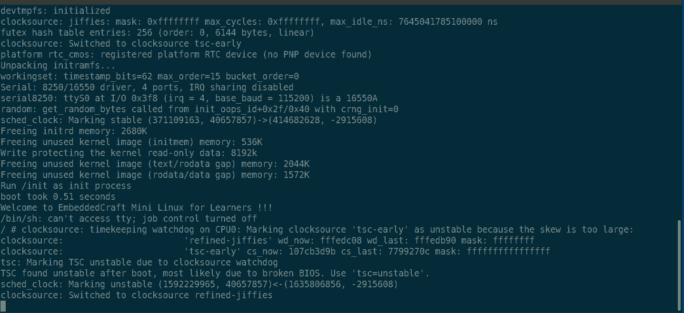

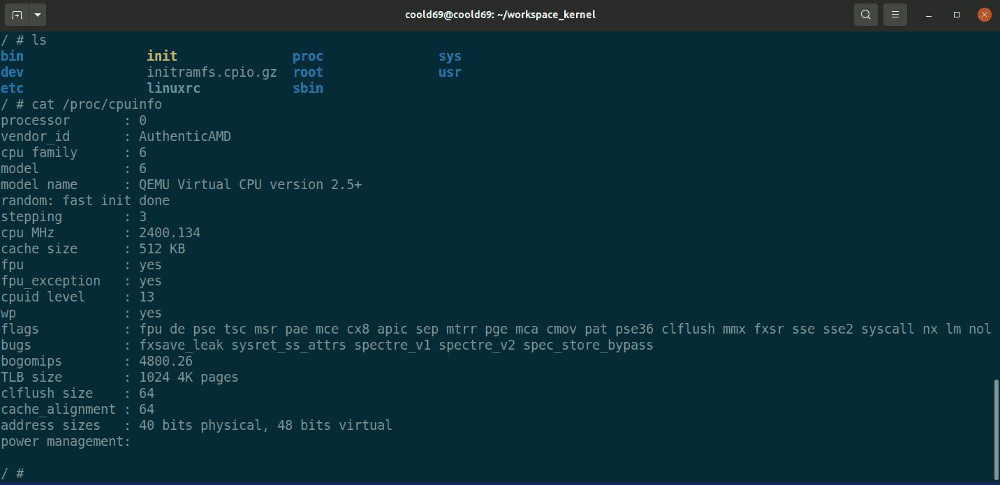

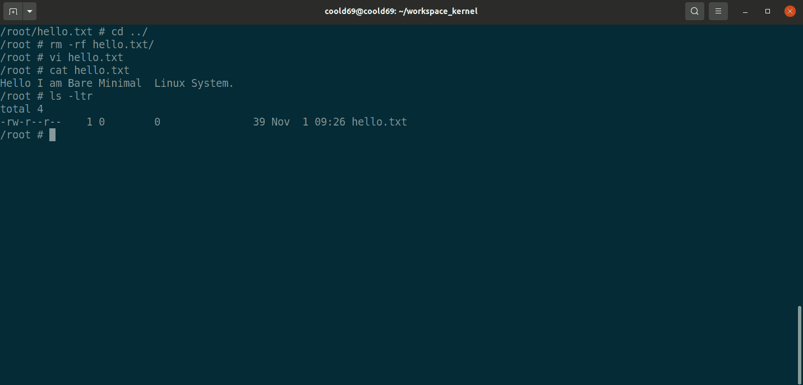

---

## References

- [Mastering Embedded Linux Programming - Second Edition.pdf](https://github.com/PacktPublishing/Mastering-Embedded-Linux-Programming-Second-Edition)

- [Compiling a kernel for QEMU with graphics support](https://github.com/byte4RR4Y/aarch64-kernel-for-qemu) or in [aarch64-kernel-for-qemu.md](aarch64-kernel-for-qemu.md)

- [Setup: Ubuntu host, QEMU vm, x86-64 kernel](https://github.com/google/syzkaller/blob/master/docs/linux/setup_ubuntu-host_qemu-vm_x86-64-kernel.md) and [create-image.sh](https://raw.githubusercontent.com/google/syzkaller/master/tools/create-image.sh)

- [Tutorial: Building the Simplest Possible Linux System](https://youtu.be/Sk9TatW9ino?si=d300B9ARC82QXXKG)

- [Landlay.net/toybox](https://landley.net/toybox/)

- [Kernel.org](https://www.kernel.org/)

- [Linux kernel QEMU setup](https://vccolombo.github.io/cybersecurity/linux-kernel-qemu-setup/)

