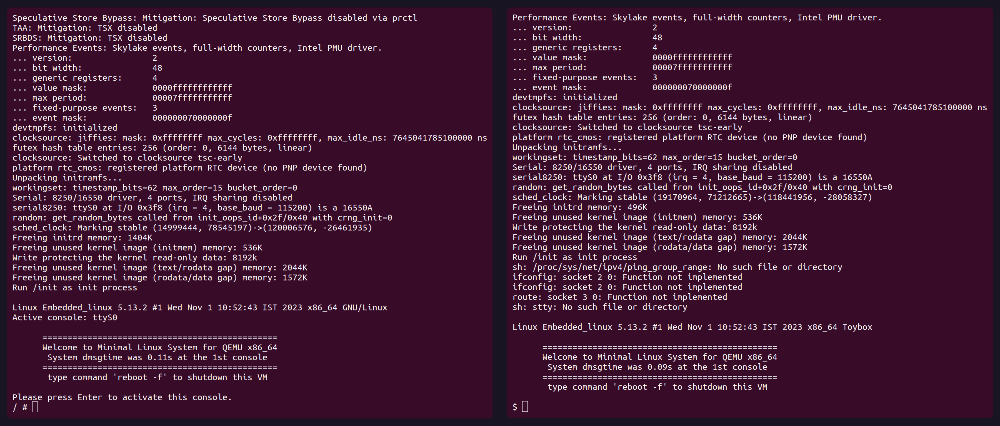

# Bare Minimal Linux Kernel & RootFS

- Support this project and in particular the [gzcmd.sh](gzcmd.sh) development donating [here](https://github.com/sponsors/robang74).

> [!NOTE]
> 
> Compared to the original project from which this repo has been forked the changes
> in initramfs.cpio are in `update` folder, and the `README.md`. While `start.sh`
> has been added to facilitate the use for those clone or download the zip file.

- **Linux** Kernel version 5.13.2 &nbsp; (or [6.17.0](https://landley.net/bin/mkroot/0.8.13/) by mkroot)

- **BusyBox** version 1.33.1 &nbsp; (or a newer version as explained in [here](busybox/README.md))

- **ToyBox** 0.8.13 &nbsp; (as a lighter alternative, downloaded from mkroot project)

- **gzcmd.sh** v0.1.5 &nbsp; (as a PoC of a KISS self-extracting ELF compressor)

---

## Quick start

> [!NOTE]
> 
> Note that `start.sh` updates the initramfs.cpio.gz using the `update/initramfs` content
> and checking the  `update/initramfs.md5` against the result for reproducibility.

- download [`bzImage`](https://github.com/robang74/bare-minimal-linux-system/raw/refs/heads/main/bzImage), [`initramfs.cpio.gz`](https://github.com/robang74/bare-minimal-linux-system/raw/refs/heads/main/initramfs.cpio.gz) and the [`start.sh`](https://github.com/robang74/bare-minimal-linux-system/raw/refs/heads/main/start.sh) script

  - or downlod and extract the [zip archive](https://github.com/robang74/bare-minimal-linux-system/archive/refs/heads/main.zip) of the wholre repository.

- launch with the script `sh start.sh` the QEMU virtual machine

- alternatives: [initrobfs.cpio.gz](initrobfs.cpio.gz) with toybox and Linux [x86_64.tgz](https://landley.net/toybox/downloads/binaries/mkroot/0.8.13/x86_64.tgz) 6.17.0 w/ network support by Rob Landlay

- boot time in a QEMU single processor instance takes **1/10 of second**, on average (runs on a Thinkpad 2019, i5-8365U CPU).


---

### QEMU install for Ubuntu

```sh
sudo apt update
sudo apt install qemu-kvm libvirt-daemon-system libvirt-clients bridge-utils virt-manager

sudo adduser $USER libvirt
sudo adduser $USER kvm
```

A quick test to check installation

```sh
kvm-ok
qemu-system-x86_64 --version
```

This is an optional but useful for those who wants customise the system quickly

```sh
sudo apt install fakeroot
```

---

## References

- [Mastering Embedded Linux Programming - Second Edition.pdf](https://github.com/PacktPublishing/Mastering-Embedded-Linux-Programming-Second-Edition)

- [Compiling a kernel for QEMU with graphics support](https://github.com/byte4RR4Y/aarch64-kernel-for-qemu) or [here](docs/aarch64-kernel-for-qemu.md)

- [Setup: Ubuntu host, QEMU vm, x86-64 kernel](https://github.com/google/syzkaller/blob/master/docs/linux/setup_ubuntu-host_qemu-vm_x86-64-kernel.md) and [create-image.sh](https://raw.githubusercontent.com/google/syzkaller/master/tools/create-image.sh)

- [Tutorial: Building the Simplest Possible Linux System](https://youtu.be/Sk9TatW9ino?si=d300B9ARC82QXXKG)

- [Landlay.net/toybox](https://landley.net/toybox/)

- [Kernel.org](https://www.kernel.org/)

- [Linux kernel QEMU setup](https://vccolombo.github.io/cybersecurity/linux-kernel-qemu-setup/)

---

## Copyright

(c) 2026, Roberto A. Foglietta <roberto.foglietta@gmail.com>, CC BY-NC-ND 4.0


